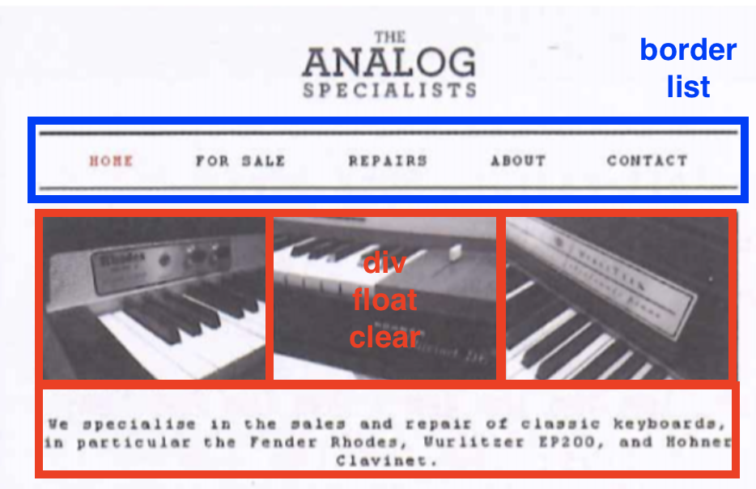

# UGWebDevelopment
Codes for Front-End Design and Development of E-commence System

## hmwk1_html
### Requirements
1. html file
2. table
3. as many elements as possible
4. readability (comments, camel naming, etc.)
5. deadline March 30

### Design
reference: 
1. [集合啦！动物森友会图鉴](https://diobulanduo.gitee.io/animalcrossing.github.io/#/furniture)
2. [Devil Fruits|One Piece](https://onepiece.fandom.com/wiki/Devil_Fruit)

## hmwk2_css3
### Requirements
1. html + css
2. layout as follows:
	
	1. menu using `<li style="display: float;">`
	2. table using css+div
	3. design
3. readability (comments, camel naming, etc.)
4. deadline April 20
